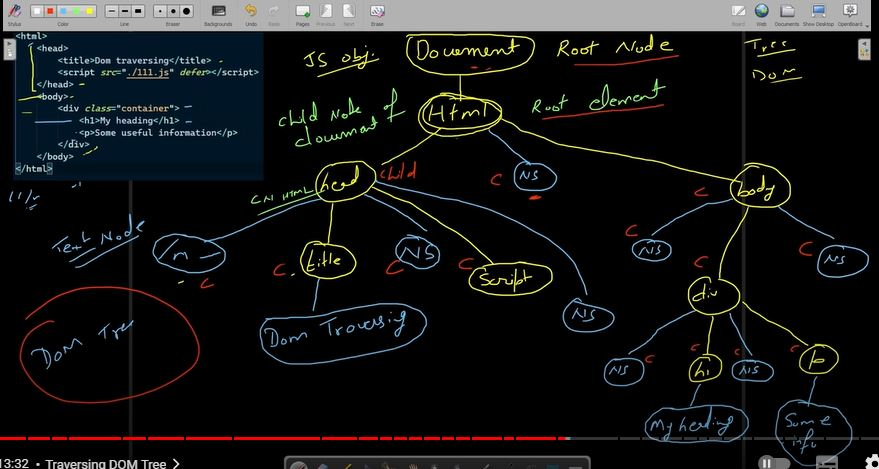

# DOM traversal :

- The root node i.e 'document' will always have only one child node i.e 'html' and then so on.
- Text node contains a 'new line' and some 'space'. When we close an element and start writing a new element, we go to next line and give some space. This is stored in text node. This can be eliminated by writing new element on same line.
- By default browser eliminates the Text nodes by setting the 'white-space' property in CSS to 'normal'. If you set it to 'pre' you can see the white spaces.

## HTML code :

```html
<html>
    <head>
        <title>Dom traversing</title>
        <script src="./script.js" defer></script>
    </head>
    <body>
        <div class="container">
            <h1>My heading</h1>
            <p>Some useful information</p>
        </div>
    </body>
</html>
```

## DOM tree of above code :



## Gets root node of DOM tree :

```javascript
const rootNode = document.getRootNode()
console.log(rootNode)
```

## Returns a node list of child nodes of root node :

```javascript
console.log(rootNode.childNodes)
```

## prints html node's child nodes :

```javascript
const htmlElementNode = rootNode.childNodes[0]
console.log(htmlElementNode.childNodes)
```
## prints the html code :

```javascript
console.log(htmlElementNode)
```
## find parent of a given node :

```javascript
const headElementNode = htmlElementNode.childNodes[0]
console.log(headElementNode.parentNode)
```
## Find Sibling nodes :

```javascript
console.log(headElementNode.nextSibling) // returns 'text'
console.log(headElementNode.nextSibling.nextSibling) // body
```
##  Gives the next sibling node by ignoring all the text nodes :

```javascript
console.log(headElementNode.nextElementSibling)
```

##  Children property - returns an HTML collection :

```javascript
const container = document.querySelector('.container')
console.log(container.children)
```


